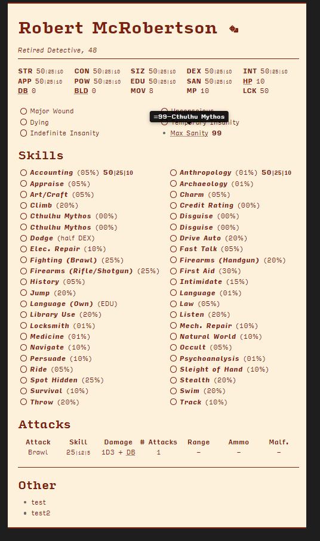

# TTRPG Helper Tools

Some personal tools for ttrpgs (mainly Call of Cthulhu)



## Features
- Calculate and insert 1/2 and 1/5 stats for Call of Cthulhu
- Mouseover glossary

## Usage
### Stat Calculator
- Start scraping stats by calling it from the frontmatter: `statcalc: true`
- Place any stats you want calculated between curly braces: `{100}` will result in `100 | 50 | 20`
- Style the new elements with `.ttrpgtools-inline` and `.ttrpgtools-hover`
- Options can be added as a block list or inline

`statmod : [style: inline, separator: "-"]`
```
statmod :
 - style: inline
 - separator: "-"
 ```

| Option    | Description                                        | Default |
| --------- | -------------------------------------------------- | ------- |
| position  | location of the tooltip (left, right, top, bottom) | top     |
| separator | The separator between stats                        | " \| "  |
| style     | `inline` or `toolip`                               | inline  |

### Glossary
- Call it from the frontmatter: `glossary: filename`
- The glossary must be a MD file with the text in JSON
- Aliases may be added by setting the value to `glossary.term`
- Style the new elements using `.ttrpgtools-glossary`

Example:
```
{
"BLD":"glossary.Build",
"Build":"SIZ + STR\n2-64: -2\n65-84: -1\n85-124: 0\n125-164: 1\n+1 for each additional 80pts",
"DB":"glossary.Damage Bonus",
"Damage Bonus":"SIZ + STR\n2-64: -2\n65-84: -1\n85-124: 0\n125-164: +1D4\n165-204: +1D6\n+1D6 for each additional 80pts",
"HP":"=CON+SIZ/10",
"Max Sanity":"=99-Cthulhu Mythos"
}
```

## Disclaimer
This is poorly coded. I made this for personal use, so it probably interferes with/breaks other plugins. Use at your own risk

## Bonus
- CSS style based on Homebrewery/CritterDB. Enable with `cssClass: statblock`